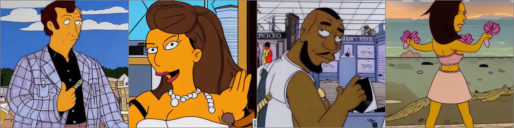
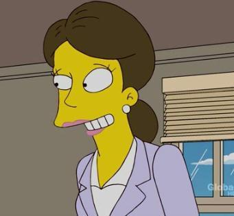
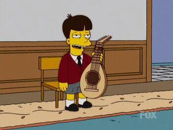
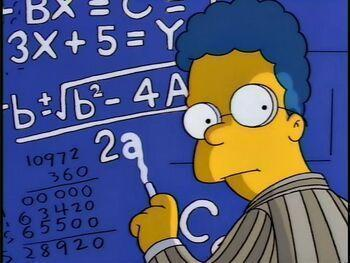
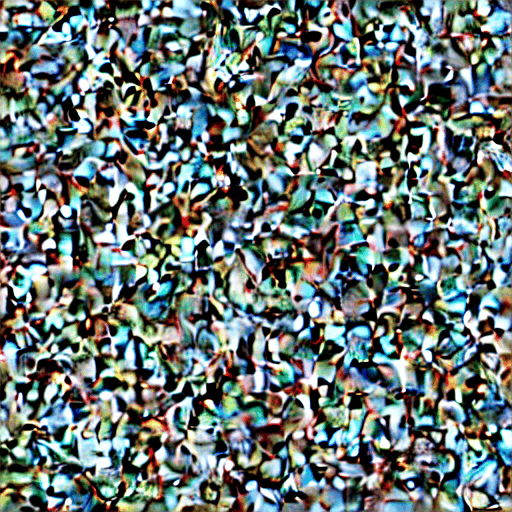

# Text-to-The Simpsons

In this blog I will adapt the Stable Diffusion deep learning model to generate high fidelity images in the style of The Simpsons, given any text prompt. Stable Diffusion can produce very photo-realistic images, but this project will be the first to fine-tune the model so all images generated by the model look like they were produced for the cartoon The Simpsons. Text-to-image models typically require lots of data and compute power. However, by using an open source model I can achieve the desired result with a relatively small dataset and a single GPU.

I start off with Stable Diffusion, an open source text-to-image model created by stability AI. The weights are hosted on [huggingface](https://huggingface.co/CompVis/stable-diffusion-v1-4) and can easily be downloaded. This model represents a large improvement over previous text-to-image models: inference takes 5 seconds and only requires 5GB of VRAM, so the model can run on consumer GPUs. Furthermore, fine tuning of this model can run on a single GPU. There are 1 billion parameters in the Stable Diffusion model, which is much less than the GP3 or BLOOM models, both of which are large language models and have 100s of billions of parameters.

## Training Dataset

To fine-tune the Stable Diffusion model I needed some images of The Simpsons characters, and corresponding text descriptions for these images. I looked at [The Simpsons wiki](https://simpsons.fandom.com/wiki/Category:Characters) and used [BeautifulSoup](https://www.crummy.com/software/BeautifulSoup/bs4/doc/) to scrape 800 images from the website. The website had a relatively simple structure and lots of good images of characters from The Simpsons. 

One issue was that the images were in different formats. I found that the [PIL](https://pillow.readthedocs.io/en/stable/reference/Image.html) library had all the tools needed to put the images into a consistent RGB JPEG format.  

However, to fine-tune the model to produce images in the style of The Simpsons, I also needed text descriptions of my images of characters from The Simpsons. For this I used the [BLIP model](https://github.com/salesforce/BLIP) which produces captions for images. I uploaded my dataset to huggingface and it is available [here](https://huggingface.co/datasets/skiracer/simpsons_blip_captions).

### Image and Captions

a woman in a purple suit

{: width="150"}

a man holding a guitar

{: width="150"}

a cartoon character with a math board in the background

{: width="150"}

## Stable Diffusion info

The Stable diffusion is made up of a pipeline:

- CLIP 
- UNET and Scheduler
- Diffusion Decoder

CLIP is a model that takes text as input and produces a latent embedding. "UNET and Scheduler" processes the latent embedding of the text to further understand the meaning of the text prompt. Finally, the Diffusion AutoEncoder takes the latent information and creates an image. 

For fine-tuning the model I kept the weights of the CLIP model frozen and only fine-tuned the weights of the Diffusion AutoEncoder and UNET. To implement the training code I used a fork of the original stable diffusion training code which had been altered to read images from a folder. The code worked well but because it is designed for training with massive datasets, and defines many models, it can be hard to do simple tasks: I noticed lots of people were strugging to get the model to work in the associated Github issues page.

For training I used an A100 GPU with 80GB of VRAM. However, during training, the RAM never spiked above 40GB so an A6000 GPU would also have worked. The code is entirely GPU bound so the number of CPUs did not matter. In total, each epoch of training took around 3 minutes. I saved a snapshot of the model after every 10 epochs of training, each snapshot required 16GB of disk space. To validate the model performance during training, I used several text prompts to generate images from the model every 10 epochs. I analysed these images qualitatively to see how close to The Simpsons the generated images were getting.

After 60 epochs of fine-tuning, I decided the model was starting to overfit. I then generated images for each text prompt for each of the 6 saved model snapshots. In hindsight I wished I had made a prediction after every 2 epochs to create very smooth gifs in the results section so each gif would have 30 images rather than 6 images.

## Results

Below, the GIFs show how images generated for the same text prompt change over fine-tuning of the model. I used 4 different random seeds to produce 4 different text embeddings from the CLIP model for the same input text prompt. These 4 text embeddings were used to generate images from the fine-tuned model for each of the 6 model checkpoints, saved during fine-tuning of the model. The first image uses the weights from the open-source Stable Diffusion model. The final image uses the weights of the fine-tuned model after 60 epochs.

girl with pearl earing

a painting of the goddess aphrodite

superman

a man playing the saxophone

elon musk flying a rocket

emma radacanu playing tennis

boris johnson

tyson fury

magnus carlsen playing chess

black panther

the hulk

I find it surprising how similar  the images produced for the same text prompt are for each of the 6 model checkpoints during fine-tuning: the poses are the same, the objects in the images are the same, and the colour palette remains similar. However, the style of the photos becomes unmistakably more like The Simpsons for more heavily fine-tuned models: the images become more cartoon-like, with block colouring, and large noses, eyes and mouths for the characters.

I also created a gif that shows the formation of the images through the different diffusion steps. Initially there is just noise which is then transformed slowly into a realistic image.

The weights of the final model are available [here](https://huggingface.co/skiracer/sd-simpsons-diffusers/tree/main). They are compatible with the huggingface diffusers [library.](https://github.com/huggingface/diffusers)

## TODO

- Hugging face has a very nice library for diffusion models and I want to update the weights so they are compatible. DONE
- Upload weights file to huggingface in fp16. This will make inference and download speed faster.  

## References: 

The idea came from a pydata talk by Justin Pinkey where he fine tuned stable diffusion to produce images in the style of Pokémon.
